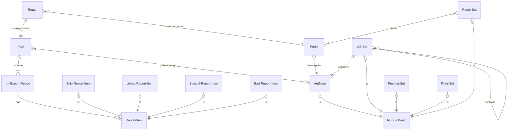

# Database Design

```mermaid
erDiagram
Im-Export-Report ||--o{ Report-Item : has
Path ||--|{ Im-Export-Report : contains
Path }|--|{ AutNum : goes-through
Route ||--|| Path : corresponds-to
Route }o--|| Prefix : corresponds-to
Route-Set }o--|{ Prefix: contains
Prefix }|--|| AutNum : belongs-to
AS-Set ||--o{ AutNum : contains
AS-Set ||--o{ AS-Set : contains
AutNum |o--|| RPSL-Object : is
AS-Set |o--|| RPSL-Object : is
Peering-Set |o--|| RPSL-Object : is
Filter-Set |o--|| RPSL-Object : is
Route-Set |o--|| RPSL-Object : is
Skip-Report-Item |o--|| Report-Item : is
Unrec-Report-Item |o--|| Report-Item : is
Special-Report-Item |o--|| Report-Item : is
Bad-Report-Item |o--|| Report-Item : is
```

Other:

- Skip/unrecorded… reports can refer to AS/AS Set, etc..
