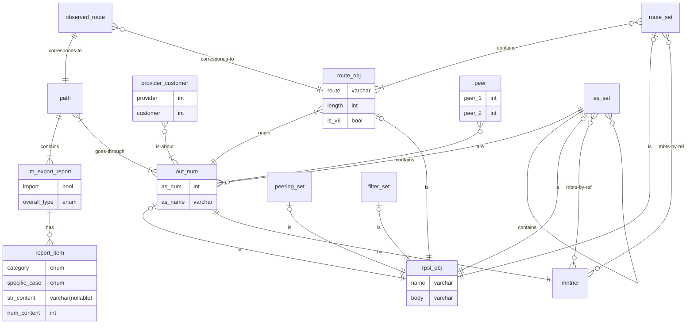

# Project Description

A REST API server for network operators to query routing policies and the verification reports for observed routes against these policies. The goal is to help operators verify the policies they publish and diagnose inconsistencies between policies and routes.

## Routing policy

Routing policies are retrieved from the Routing Policy Specification Language (RPSL) in the [Internet Route Registry (IRR)](https://www.irr.net/docs/list.html). Specified with the RPSL, each Autonomous System (AS) has its policies to accept or reject routes when importing or exporting them. Our service records these policies.

## Route verification report

We verify observed routes against the recorded policies to generate reports. Observed routes are from the [University of Oregon Route Views Archive Project](https://archive.routeviews.org/). Within each route, each import and export between two ASes is verified using their recorded policies; one report is generated for each import/export.

Each report contains both an overview and details of the verification. The overview ranges from "ok" to "bad". The details are lists of specific report items including the error types, skip reasons, and special cases.

We use [Internet Route Verification](https://github.com/SichangHe/internet_route_verification) to generate the reports.

## Motivation/ needs

- A structured way to query the IRR with a focus on routing policies.
- Storage and structured query for the large amount of observed routes and verification reports generated from them.

## User-facing functionality: query RPSL, routes, and reports

Users can query RPSL, routes, reports, and specific report items for a given AS, vice versa for specific use.
For example, query for the reports related to a specific AS; query for the ASes that have a specific type of report item; and query for routes related to a specific maintainer.

## Sketch of database design

- All objects have `time_updated`.
