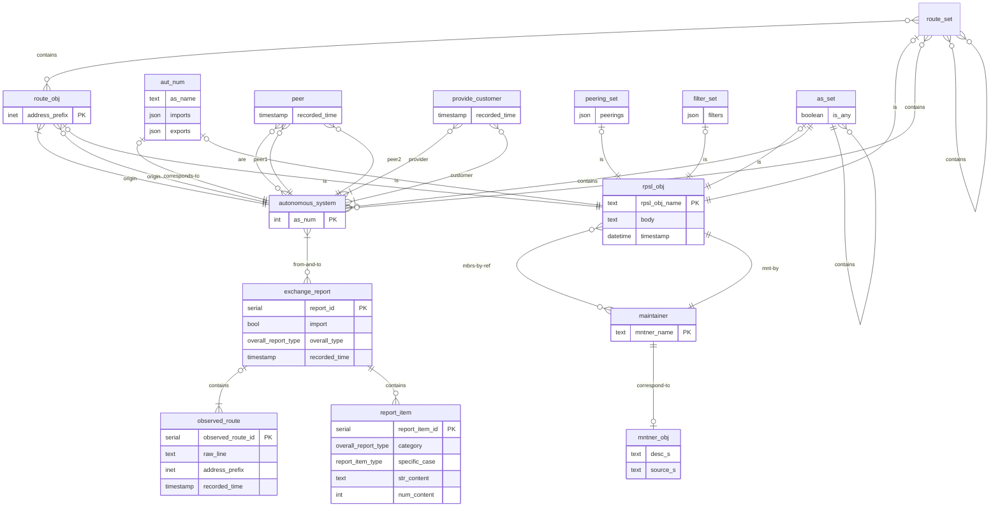

# Entity-Relationship (ER) Model

An ER model representing this group project. Visualization:

Explanation and discussion for designed entity sets and relationship sets:

`rpsl_obj`, `maintainer`, and `autonomous_system` are basic entity sets
representing RPSL objects, maintainer objects, and AS objects.
The `rpsl_obj` has a multi-valued attribute `mnt_by` to store which maintainers
an RPSL object is maintained by.
`aut_num` is a weak entity set identified by its `autonomous_system` and
it is also related to `rpsl_obj` one-to-one.
Each `observed_route` has a multi-value composite attribute `exchange_report`,
and each `exchange_report` has a multi-value composite attribute `report_item`.
`autonomous_system` can have many-to-many provider-customer relationship with
each other in the `provider_customer` relationship set,
or they can have many-to-many peer-to-peer relationship with each other in
the `peer` relationship set.
`peering_set`, `filter_set`, `as_set`, and `route_set` are weak entity sets
identified by its `autonomous_system`.
`as_set` has a multi-value attribute `mbrs_by_ref` to refer to
its members by being referenced from the ASes,
a multi-value attribute `num_members` for specifying AS members,
and a multi-value attribute `set_members` for specifying AS Set members.
Same for `route_set`.

# Relational Model

Converted relational database model, visualized in a schema diagram:

Explanation for each step carried out:

The primary key of `rpsl_obj`, `maintainer`, `autonomous_system` in
the entity set are used as their primary key in the relational model.
Composite attributes `exchange_report` and `report_item` are
converted into tables with each attribute separated.
New relations are created for multi-value attributes
`rpsl_obj`'s `mnt_by` and `mbrs_by_ref`, `exchange_report`, `report_item`,
`as_set` and `route_set`'s  `num_members` and `set_members` as
`rpsl_obj_mnt_by` and `mbrs_by_ref`, `exchange_report`, `report_item`,
`as_set_contains_num`, `as_set_contains_set`, `route_set_contains_num`,
and `route_set_contains_set`.
Weak entity sets `aut_num`, `peering_set`, `filter_set`, `as_set`,
and `route_set` have their identifying entity sets' primary keys as
their primary keys, with foreign-key constraints on them.
